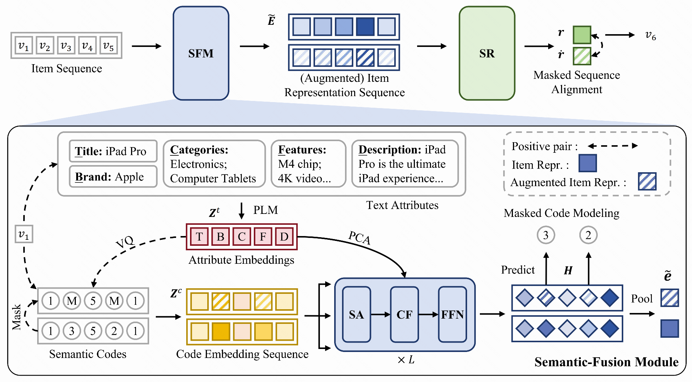

# CCFRec

This is the official PyTorch implementation for the paper:

> [Bridging Textual-Collaborative Gap through Semantic Codes for Sequential Recommendation](https://arxiv.org/abs/2503.12183)

## Overview

We propose **CCFRec**,  a novel **C**ode-based textual and **C**ollaborative semantic **F**usion method for sequential **Rec**ommendation. The key idea behind our approach is to bridge the gap between textual and collaborative information using semantic codes. Specifically, we generate fine-grained semantic codes from multi-view text embeddings through vector quantization techniques. Subsequently, we develop a code-guided semantic-fusion module based on the cross-attention mechanism to flexibly extract and integrate relevant information from text representations. In order to further enhance the fusion of textual and collaborative semantics, we introduce an optimization strategy that employs code masking with two specific objectives: masked code modeling and masked sequence alignment. The merit of these objectives lies in leveraging mask prediction tasks and augmented item representations to capture code correlations within individual items and enhance the sequence modeling of the recommendation backbone.

## Dependency
Please install required packages via `pip install -r requirements.txt`

## Quick Start

Generate semantic codes

`cd vq`

`python generate_faiss_multi_emb.py --config instrument.yaml`

Train the model

`bash run.sh`

